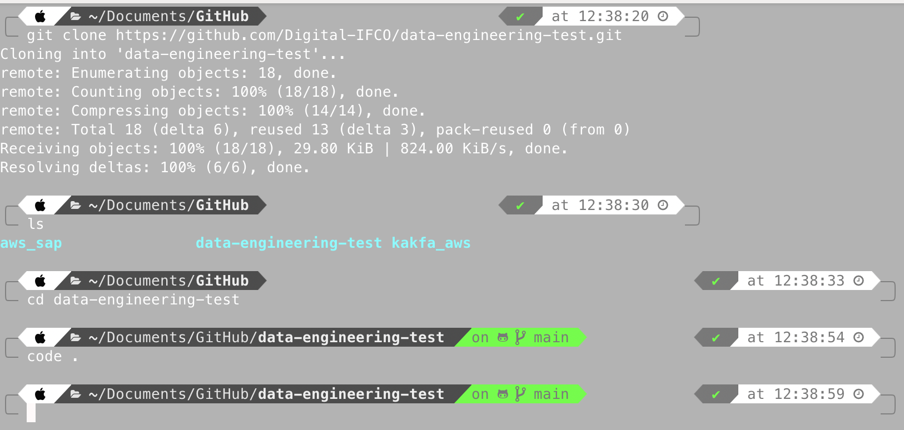
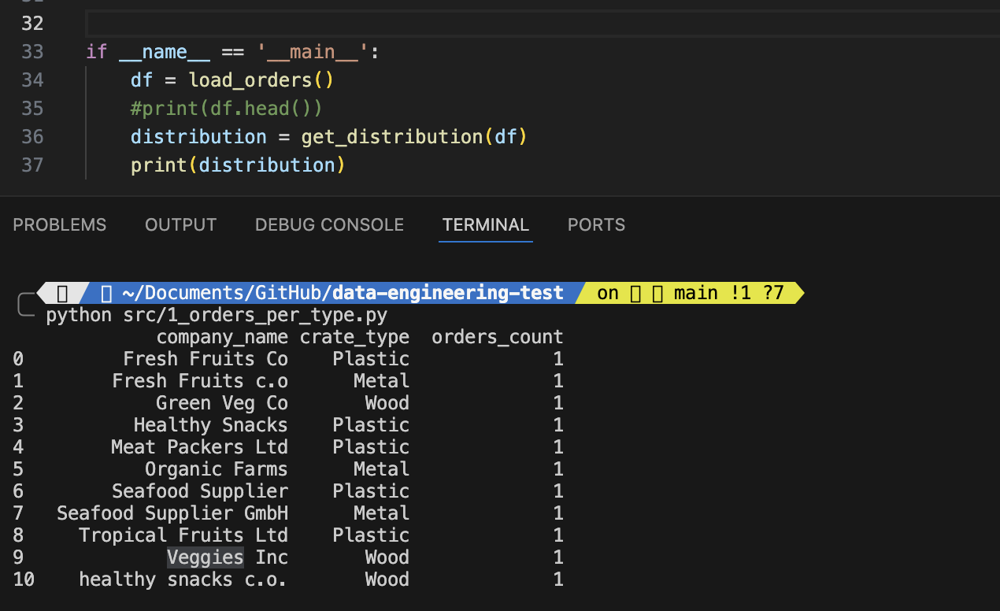

## 1 - Preparing the environment

To start we can create a new folder in our local machine, to clone the source repository, and opened in VSCode.
<p align="center">
  
</p>

In VSCode, open terminal and:
- Create a new README file and updated.
- Configuring the Python virtual environment, with the latest stable python version (V3.12 at October 16)

```
$ python3 --version  
$ python3.12 -m venv venv 
```

- Now, a new folder was created, with the venv files, we need to activate it.

```
$ source venv/bin/activate   
```
- Create a requirement.txt file to list all the necesary Python libraries, and installed at once (if you don't know it at the beggining, you can just installing locally and later generate the requirement file with the command: $pip freeze > requirements.txt ). 

```
$ pip install -r requirements.txt
```


- Create the folders needed to organice the process: src folder for the python code and test folder for the test python code.
```
$ mkdir test
$ mkdir scr
```

## 2 - Developing the solution

NOTE: I decided to create one different python file for each requirement in the challenge. 

### Test 1: Distribution of Crate Type per Company

- Create the 1_orders_per_type.py file
- Define 2 main functions: 
- - The first one to load the df with the content of orders.csv
- - The second one to get the distribution number group by company name and box type.
- To test this code I added the condition "if __name__ == __main__"

<p align="center">
  
</p>


---------
Add quality scripts
: some of the company names seems same, I consider to get similar name as the same company, with a new column name.