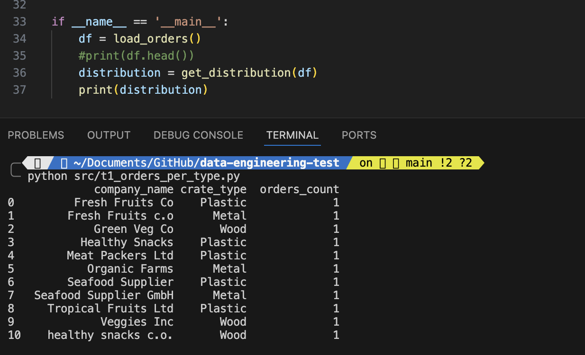

## 1 - Preparing the environment

To start, I create a new folder on the local machine, to clone the source repository and open it in VSCode.
<p align="center">
  
</p>

After that, I remove the Github origin and add my new origin, a new repository in my Github account, to save the challenge solution.

```
$ git remote remove origin 
$ git remote add origin https://github.com/rsradulescu/IFCO-data-engineering-solution-test.git        
```

In VSCode, open the terminal and:
- Created a new README file and updated it.
- I set up the Python virtual environment, with the latest stable version of Python (V3.12 as of October 16).

```
$ python3 --version  
$ python3.12 -m venv venv 
```

- Now a new folder has been created, with the venv files, we must activate it.
```
$ source venv/bin/activate   
```
- Create a requirement.txt file to list all the required Python libraries, and install them at once (if you don't know at first, you can install it locally and then generate the requirement.txt file with the command: $pip freeze > requirements.txt ).
```
$ pip install -r requirements.txt
```
- Create the necessary folders to organize the process: /src folder for the Python code and /test folder for the test Python code.
```
$ mkdir test
$ mkdir scr
```

## 2 - Developing the solution

NOTE: I decided to create a different Python file for each challenge task. In practice, I prefer to put all the related functions together in one model file and test them in another location.

### Test 1: Distribution of Crate Type per Company

- Create the t1_orders_per_type.py file.
- Define 2 main functions: 
  - The first to load the df with the contents of orders.csv 
  - The second to get the group of distribution numbers by company name and crate type.
- To test this code I added the condition "if __name__ == __main__"

<p align="center">
  
</p>

- For unit testing, I create a new Python file in the tests folder called ut1_order_per_type.py.
- Here I use the unittest library (part of Python) to test the get_distribution function.
- The idea is to compare a new simple test df with columns [company_name, create_type, order_id] and an expected df.
- After applying the get_distribution function on the test df, the result should be the same as the expected df.

<p align="center">
  
</p>

### Test 2: DataFrame of Orders with Full Name of the Contact
- Import the first file we created above to use the upload function.
- Create a function to get a json object with contact data. Extract the name and subname and return the concatenation.
- If any of these values ​​are missing or if contact_data is empty, return the placeholder "John Doe".
- Apply the above function to each row in the df.

<p align="center">
  
</p>

- For the unit test I create the ut2_orders_full_name python file.
- I include several test cases for diverse scenarios:
  - Have boths name and surname: ideal case, show both.
  - Have only name or only surname: show 'John Doe' as placeholder if some of these are not abailable.
  - Have empty data: show 'John Doe' placeholder.
  - Have extra double quotes: Remove the extra quotes and consider showing both first and last name.

<p align="center">
  
</p>

### Test 3: DataFrame of Orders with Contact Address (city+cp)
- Import the first file we created above to use the upload function.
- Create a function to get a json object with contact data. Extract the city and postal code and return the concatenation.
- If any of these values ​​are missing, replace the city with "Unknown" and the postal code with "UNK00" (or both if contact_data is empty).
- Apply the above function to each row of the df.

<p align="center">
  
</p>

- For the unit test I create the ut3_orders_contact_address python file.
- I include several test cases for diverse scenarios:
  - Have both city and postal code.
  - Have only city or only postal code.
  - Have empty city and cp: show placeholder for city and postal code.
  - Have None in contact_data.

<p align="center">
  
</p>


### Test 4: Calculation of Sales Team Commissions
- Create a new function load_invoices to load the invoice json file into a df.
- Inside this function load_invoices calculates the net value from the gross value and VAT.
- Create a function get_commission that receives orders_df and invoices_df and merges them.
- Set commission rates, list suppliers and assign a commission rate based on the position in the list.
- Convert commission from cents to euros and sort the list in descending order of performance.

<p align="center">
  
</p>

- The unit test verify the accuracy of the commission calculations and sort order.

<p align="center">
  
</p>

### Test 5: DataFrame of Companies with Sales Owners
- Load the df from orders csv file and create a new function to get the company name and owners list.
- Inside the function, I first create a new column to normalize the company names, keeping in mind that duplicate companies are stored with multiple IDs due to slight variations in the company name. To identify the same companies, I consider lowercase names and remove non-alphanumeric characters.
- I remove duplicate companies, merge the list of owners, and consider the first company name and id to identify the company. 
- Return as a df_3

<p align="center">
  
</p>

- For the unit test, I first create a sample df similar like the source orders csv file. 
- I create 2 different scenarios to test:
  - test_create_company_salesowners_df: Check is correctly merges duplicate companies and collects sales owners. Compares the resulting DataFrame with the expected DataFrame.
  - test_duplicate_companies_handling: Check if duplicate companies are correctly identified and merged.

<p align="center">
  
</p>

---------
#  Extra
## CICD

I added a CI/CD pipeline using GitHub Actions, in the GitHub repository, that will automatically run unit tests whenever code is pushed to the main branch. This helps maintain code quality and catches issues early in the development.
You can find the yaml workflow file in the folder: .github/workflows
Some details in the worflow:
- Matrix strategy is set up to ensure that the test can run successfully on at least two versions of Python: 3.11 and 3.12.
- We install all the necessary libraries, which are in requirements.py
- On the last line use "test discover" to run all the tests in the /test directory, which has the pattern in the name "ut*.py" (starts with 'ut' and ends with '.py')
- After the changes are pushed, we can see the successful execution in Github Actions.

<p align="center">
  
</p>

## Data modeling
Data modeling is essential in the data engineering process to organize raw data into a structured format that enables efficient querying and analysis. 
For this solution I suggest to use a dimensional model, because it simplifies complex relationships by separating facts (invoices) from dimensions (orders, companies, contacts, salesowners). It improves query performance by minimizing joins and supports scalability, making it suitable for business intelligence and reporting. 

<p align="center">
  
</p>

DBT (Data Build Tool) is a great solution for applying data modeling because it allows data engineers to transform raw data into clean, analytics tables using SQL. 
In order to not delay the delivery of the work, I omitted the development in DBT here.

----
Thank you for the opportunity to solve this challenge. I’m excited about the Data Engineer position and the chance to join your team.
Looking forward to the possibility of working together!